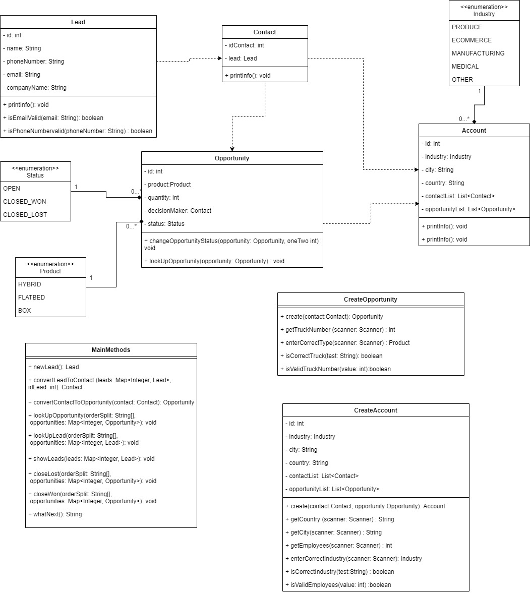
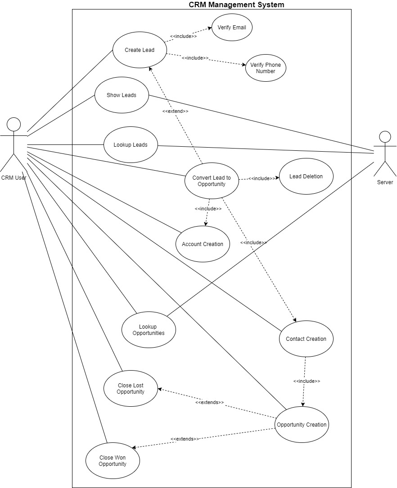

# CRM-System By Code Warriors

Welcome to CRM-System, the sales tracking application.

CRM will help you:

- Gather contact information from customers who may or may not be interested in your product.

- Convert leads into sales opportunities when they show interest in buying the product.

- Associate an opportunity with an account.

- Associate contacts with an opportunity.

*With this application you will be able to carry out an exhaustive market analysis. You can see, for example, which are the best-selling products, or in which city or country the most orders have been placed. In addition, you will also be able to know the number of successful sales that salesreps have had, among many other options. This type of analysis will undoubtedly help you to be sure of your next steps in the market*.

The application instructions are detailed below:

At the beginning, if the user does not know which commands are available, he can enter COMMANS HELP via the console. A list like this will be displayed:

## COMMANDS HELP

---**GENERAL COMMANDS**---

The very first order will always be to create a **new lead (NEW LEAD)**, as this is the way to obtain a new customer. To create this lead, the user will be asked to enter their name, telephone number, email and the company to which the lead belongs.To finish creating our  **new lead**, we must indicate our salesrep id. These variables must be entered in the appropriate format, which will be indicated in case of incorrect input.

Once one or more Leads have been created, we have the option to **SHOW LEADS**, all Leads will be displayed with their corresponding id. If you want more details of a specific lead, just enter **LOOKUP LEAD + <Lead ID>**.

When a Lead shows interest in one of the products, it will automatically become an Opportunity. To make this conversion, enter **CONVERT + <Lead ID>**, and indicate by console which product he/she is interested in (HYBRID, FLATBED, BOX) and how many of them he/she would like.

When **converting Lead to Opportunity**, two new objects will be automatically created: **Contact** and **Account**. The Contact will directly take the Lead's data (name, phoneNumber, email and companyName), while for the creation of the Account, the console will ask for the industry to which the company belongs (PRODUCE, ECOMMERCE, MANUFACTURING, MEDICAL, OTHER), the location of the company and the number of employees.

As with the Leads, the **LOOKUP OPPORTUNITY + ID** command can be entered to view information about the opportunity.

Once the customer has decided if he/she is interested in buying the products, this Opportunity can be closed, either as **CLOSE WIN** if he/she buys the products, or as **CLOSE LOST** if he/she does not want the products. 

In **GENERAL COMMANDS** you will also find the option to create a **NEW SALESREP**. To create this salesrep, the user will by asked to enter the name of this salesrep. Finally, you could also see all the salesrepsthat has already been created by entering **SHOW SALESREP**. 

---**BY SALESREP**---

In this section you can make a series of queries based on the position of the sales rep: 

**REPORT LEAD BY SALESREP**--count of Leads by SalesRep
**REPORT OPPORTUNITY BY SALESREP**-- count of all Opportunities by SalesRep
**REPORT CLOSED-WON BY SALESREP**-- count of all CLOSED_WON Opportunities by SalesRep
**REPORT CLOSED-LOST BY SALESREP**-- count of all CLOSED_LOST Opportunities by SalesRep
**REPORT OPEN BY SALESREP**-- count of all OPEN Opportunities by SalesRep

---**BY PRODUCT**---

**REPORT OPPORTUNITY BY PRODUCT**-- count of all Opportunities by product
**REPORT CLOSED-WON BY PRODUCT** -- count of all CLOSED_WON Opportunities by product
**REPORT CLOSED-LOST BY PRODUCT** -- count of all CLOSED_LOST Opportunities by product
**REPORT OPEN BY PRODUCT** -- count of all OPEN Opportunities by product

---**BY COUNTRY**---

**REPORT OPPORTUNITY BY COUNTRY** -- count of all Opportunities by country
**REPORT CLOSED-WON BY COUNTRY** -- count of all CLOSED_WON Opportunities by country
**REPORT CLOSED-LOST BY COUNTRY** -- count of all CLOSED_LOST Opportunities by country
**REPORT OPEN BY COUNTRY** -- count of all OPEN Opportunities by country

---**BY CITY**---

**REPORT OPPORTUNITY BY CITY** -- count of all Opportunities by city
**REPORT CLOSED-WON BY CITY** -- count of all CLOSED_WON Opportunities by city
**REPORT CLOSED-LOST BY CITY** -- count of all CLOSED_LOST Opportunities by city
**REPORT OPEN BY CITY** -- count of all OPEN Opportunities by city

---**BY INDUSTRY**---

**REPORT OPPORTUNITY BY INDUSTRY** -- count of all Opportunities by industry
**REPORT CLOSED-WON BY INDUSTRY** -- count of all CLOSED_WON Opportunities by industry
**REPORT CLOSED-LOST BY INDUSTRY** -- count of all CLOSED_LOST Opportunities by industry
**REPORT OPEN BY INDUSTRY** -- count of all OPEN Opportunities by industry

---**EMPLOYEECOUNT STATES**---

**MEAN EMPLOYEECOUNT** -- the average number of employees of all the registered companies 
**MEDIAN EMPLOYEECOUNT** -- the median number of employees of all the registered companies
**MAX EMPLOYEECOUNT** -- the maximum number of employees of all the registered companies
**MIN EMPLOYEECOUNT** -- the minimum number of employees of all the registered companies

---**QUANTITY STATES**---

**MEAN QUANTITY** -- mean quanitity of products ordered 
**MEDIAN QUANTITY** -- median quanitity of products ordered
**MAX QUANTITY** -- maximum quanitity of products ordered
**MIN QUANTITY** -- minimum quanitity of products ordered

---**OPPORTUNITY STATES**---

**MEAN OPPS PER ACCOUNT** -- mean number of Opportunities associated with an Account
**MEDIAN OPPS PER ACCOUNT** -- median number of Opportunities associated with an Account
**MAX OPPS PER ACCOUNT** -- maximum number of Opportunities associated with an Account
**MIN OPPS PER ACCOUNT** -- minimum number of Opportunities associated with an Account

## Class Diagram:

## Use Case Diagram:

